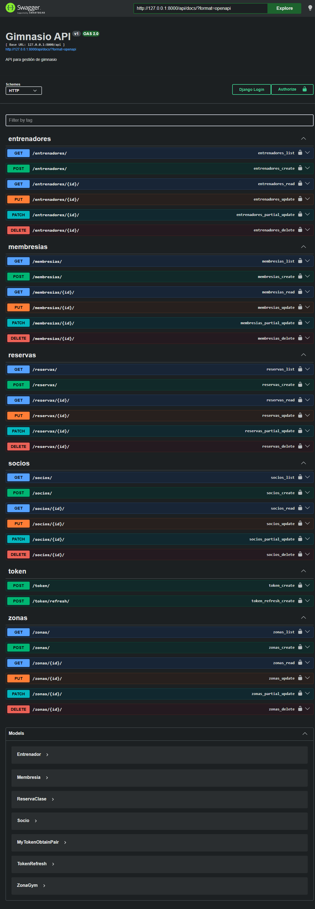

# Manual de usuario de la API de Gimnasio



## 1. Introducción
Este manual describe las APIs de la aplicación Gimnasio, su uso básico y cómo autenticarse para consumirlas. La documentación está basada en el Swagger que se expone en el backend.

## 2. Acceso a la documentación Swagger
La documentación en vivo está disponible en:

- `http://127.0.0.1:8000/api/docs/`

En esta página puedes ver los endpoints disponibles, probar solicitudes desde el navegador y consultar el esquema OpenAPI.

## 3. Autenticación JWT
La API utiliza JSON Web Tokens (JWT) para proteger los endpoints.

### Endpoints de autenticación
- `POST /api/token/` — Genera un token de acceso y refresh.
- `POST /api/token/refresh/` — Actualiza el token de acceso usando el refresh token.

### Ejemplo de login
Enviar JSON al endpoint de token:

```json
{
  "username": "admin",
  "password": "admin"
}
```

Respuesta válida:

```json
{
  "refresh": "<token_refresh>",
  "access": "<token_access>"
}
```

### Uso del token
Una vez obtenido el token de acceso, usar encabezado HTTP:

```
Authorization: Bearer <token_access>
```

## 4. Endpoints principales
Todos los endpoints principales se exponen bajo `/api/`.

### Socios
- `GET /api/socios/` — Lista todos los socios.
- `POST /api/socios/` — Crea un socio.
- `GET /api/socios/{id}/` — Obtiene detalles de un socio.
- `PUT /api/socios/{id}/` — Actualiza un socio completo.
- `PATCH /api/socios/{id}/` — Actualiza parcialmente un socio.
- `DELETE /api/socios/{id}/` — Elimina un socio.

### Membresías
- `GET /api/membresias/`
- `POST /api/membresias/`
- `GET /api/membresias/{id}/`
- `PUT /api/membresias/{id}/`
- `PATCH /api/membresias/{id}/`
- `DELETE /api/membresias/{id}/`

### Zonas
- `GET /api/zonas/`
- `POST /api/zonas/`
- `GET /api/zonas/{id}/`
- `PUT /api/zonas/{id}/`
- `PATCH /api/zonas/{id}/`
- `DELETE /api/zonas/{id}/`

### Entrenadores
- `GET /api/entrenadores/`
- `POST /api/entrenadores/`
- `GET /api/entrenadores/{id}/`
- `PUT /api/entrenadores/{id}/`
- `PATCH /api/entrenadores/{id}/`
- `DELETE /api/entrenadores/{id}/`

### Reservas
- `GET /api/reservas/`
- `POST /api/reservas/`
- `GET /api/reservas/{id}/`
- `PUT /api/reservas/{id}/`
- `PATCH /api/reservas/{id}/`
- `DELETE /api/reservas/{id}/`

## 5. Flujo de uso para un usuario
1. Iniciar el backend Django con `manage.py runserver`.
2. Abrir `http://127.0.0.1:8000/api/docs/` para revisar los endpoints.
3. Hacer `POST /api/token/` con usuario y contraseña.
4. Copiar el token `access` y usarlo en los requests protegidos.
5. Probar los endpoints de `/api/socios/`, `/api/membresias/`, `/api/zonas/`, `/api/entrenadores/` y `/api/reservas/`.

## 6. Capturas incluidas
- `docs/swagger-overview.png` — Vista general del Swagger UI.

## 7. Recomendaciones
- Si la API responde con `No active account found with the given credentials`, verificar que el backend se está ejecutando con la base de datos correcta y que el usuario está activo.
- Usar `Authorization: Bearer <token>` en todas las solicitudes a los endpoints protegidos.

---

**Nota:** Esta documentación está pensada como manual de usuario interno para desarrolladores y para el equipo que prueba la app. Puedes ampliar estas secciones con casos de uso específicos o ejemplos de payload si necesitas un manual más detallado.
