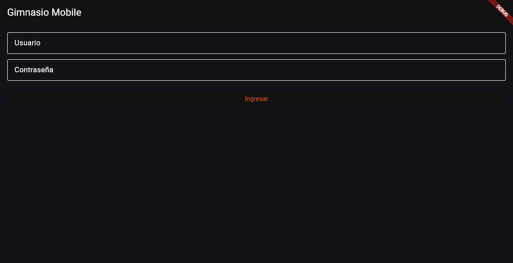

# Manual de usuario de la API de Gimnasio

## 1. Introducción
Este manual explica cómo usar la API del backend de Gimnasio, con ejemplos de autenticación y consumo de recursos.

## 2. Documentación automatizada
La API se documenta mediante Swagger en el backend. Abre esta URL en tu navegador:

- `http://127.0.0.1:8000/api/docs/`


## 3. Captura del cliente web
El cliente web prueba el login con la API. Si aparece un error de autenticación, el problema está en el backend o en la configuración del token.



## 4. Autenticación JWT
La API usa JWT para proteger los endpoints.

### Endpoints de autenticación
- `POST /api/token/` — Obtener tokens `access` y `refresh`.
- `POST /api/token/refresh/` — Renovar el token de acceso.

### Ejemplo de login
Enviar JSON:

```json
{
  "username": "admin",
  "password": "admin"
}
```

Respuesta exitosa:

```json
{
  "refresh": "<token_refresh>",
  "access": "<token_access>"
}
```

### Uso del token
Agregar el header HTTP:

```
Authorization: Bearer <token_access>
```

## 5. Endpoints principales
Los endpoints se exponen bajo `/api/`.

### Socios
- `GET /api/socios/`
- `POST /api/socios/`
- `GET /api/socios/{id}/`
- `PUT /api/socios/{id}/`
- `PATCH /api/socios/{id}/`
- `DELETE /api/socios/{id}/`

### Membresías
- `GET /api/membresias/`
- `POST /api/membresias/`
- `GET /api/membresias/{id}/`
- `PUT /api/membresias/{id}/`
- `PATCH /api/membresias/{id}/`
- `DELETE /api/membresias/{id}/`

### Zonas
- `GET /api/zonas/`
- `POST /api/zonas/`
- `GET /api/zonas/{id}/`
- `PUT /api/zonas/{id}/`
- `PATCH /api/zonas/{id}/`
- `DELETE /api/zonas/{id}/`

### Entrenadores
- `GET /api/entrenadores/`
- `POST /api/entrenadores/`
- `GET /api/entrenadores/{id}/`
- `PUT /api/entrenadores/{id}/`
- `PATCH /api/entrenadores/{id}/`
- `DELETE /api/entrenadores/{id}/`

### Reservas
- `GET /api/reservas/`
- `POST /api/reservas/`
- `GET /api/reservas/{id}/`
- `PUT /api/reservas/{id}/`
- `PATCH /api/reservas/{id}/`
- `DELETE /api/reservas/{id}/`

## 6. Flujo de uso
1. Iniciar el backend en `backend` con:
   - `.venv314\Scripts\python.exe manage.py runserver`
2. Abrir Swagger en `http://127.0.0.1:8000/api/docs/`
3. Hacer login en `POST /api/token/`
4. Copiar el `access token`
5. Usar `Authorization: Bearer <token>` en los requests protegidos

## 7. Depuración del error actual
El error actual que aparece en la app web es:

```
Error de autenticación (401): {"detail":"No active account found with the given credentials"}
```

Esto indica que la petición al backend sí llega, pero el token no se emite porque el backend no reconoce el usuario activo con esas credenciales.

### Posibles causas
- El backend de `localhost:8000` no es el mismo proceso que probaste.
- Existe otro Django corriendo con otra base de datos.
- El usuario `admin` está inactivo o usa otro password.

## 8. Recomendaciones finales
- Comprueba que el servidor Django se esté ejecutando con `.venv314`.
- Asegúrate de que la app use `http://localhost:8000/api/token/`.
- Prueba el endpoint directamente con `curl` o Postman antes de usar la app.

### Ejemplo `curl`

```bash
curl -X POST http://127.0.0.1:8000/api/token/ \
  -H 'Content-Type: application/json' \
  -d '{"username":"admin","password":"admin"}'
```

Si necesitas, puedo convertir este manual en un archivo PDF o en un documento extendido con más capturas y ejemplos de payload.
